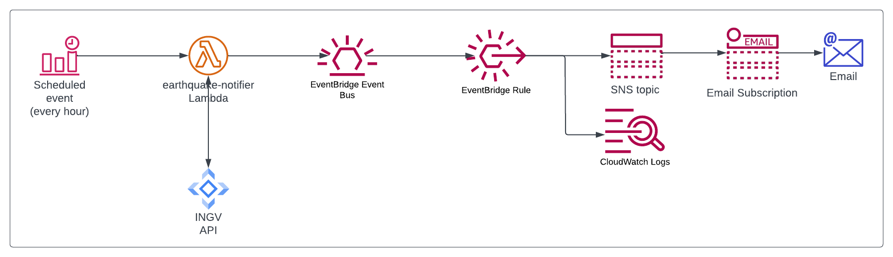

# earthquake-notifier

Serverless solution based on Lambda (in Rust), EventBridge and SNS to monitor for earthquakes and send email notifications.

Under the hood, it uses [INGV APIs](http://webservices.ingv.it/swagger-ui/dist/?url=https://ingv.github.io/openapi/fdsnws/event/0.0.1/event.yaml) and scans them every hour.


## Requirements

  - [AWS SAM](https://aws.amazon.com/serverless/sam/)
  - [Rust](https://www.rust-lang.org/)
  - [Cargo Lambda](https://www.cargo-lambda.info/)
  - [Docker](https://www.docker.com/) (required by SAM)
  - An AWS account and the [AWS CLI](https://aws.amazon.com/cli/) installed and configured


## Configuration

This solution can be configured to monitor a specific point on Earth for nearby earthquakes.

This is the list of configuration parameters that you can provide to customise it to your needs:

- `PrefixParam`: A stack prefix used to name resources (default: `earthquake-notifier`)
- `EventBusNameParam`: The name of the EventBridge bus to use (default: `default`)
- `CenterLatLonParam`: Point to monitor for close earthquakes. LatLon format (default: `37.5079,15.0830`)
- `MinMagnitudeParam`: A float representing the minimum magnitude to alert on (default: `3.5`)
- `MaxDistanceMetersParam`: The max distance from the center in meters to monitor for (default: `2000000`)
- `EmailAddressParam`: The email address to subscribe to for notifications


## Build and deployment

To build and deploy:

```bash
sam build
sam deploy --guided
```

If all goes well, now you should have a lambda running every hour on your account to check for recent earthquakes and notify you if one of them matches your conditions.


## Architecture diagram




## EventBridge events

Since this solution emits new EventBridge events every time a new earthquake is detected, you could create additional integrations on top of that.

This is a sample event that will be generated:

```json
{
  "version": "0",
  "id": "83a2ecd4-004b-bf82-3d66-be3f7ff7fc62",
  "detail-type": "earthquake",
  "source": "earthquake-notifier",
  "account": "795006566846",
  "time": "2023-03-11T11:51:35Z",
  "region": "eu-west-1",
  "resources": [],
  "detail": {
    "author": "SURVEY-INGV",
    "catalog": "",
    "contributor": "",
    "contributor_id": "",
    "depth": 82.6,
    "event_id": "34328071",
    "event_location_name": "2 km SE San Donato di Ninea (CS)",
    "event_type": "earthquake",
    "latitude": 39.6948,
    "longitude": 16.0648,
    "mag_author": "--",
    "mag_type": "ML",
    "magnitude": 3.8,
    "time": "2023-03-11T10:58:18.540Z",
    "url": "http://terremoti.ingv.it/en/event/34328071"
  }
}
```

## Local Development

You can start a local development server with:

```bash
cargo lambda watch
```

Then, in another terminal run the following command to trigger an event (and invoke your local lambda):

```bash
cargo lambda invoke --data-file events/schedule.json earthquake-notifier
```

You should see logs in the first process and the result of the lambda execution in the second process.


## Contributing

Everyone is very welcome to contribute to this project.
You can contribute just by submitting bugs or suggesting improvements by
[opening an issue on GitHub](https://github.com/lmammino/earthquake-notifier/issues).


## License

Licensed under [MIT License](LICENSE). © Luciano Mammino.